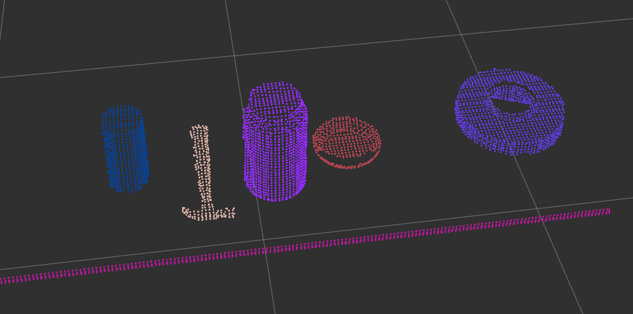
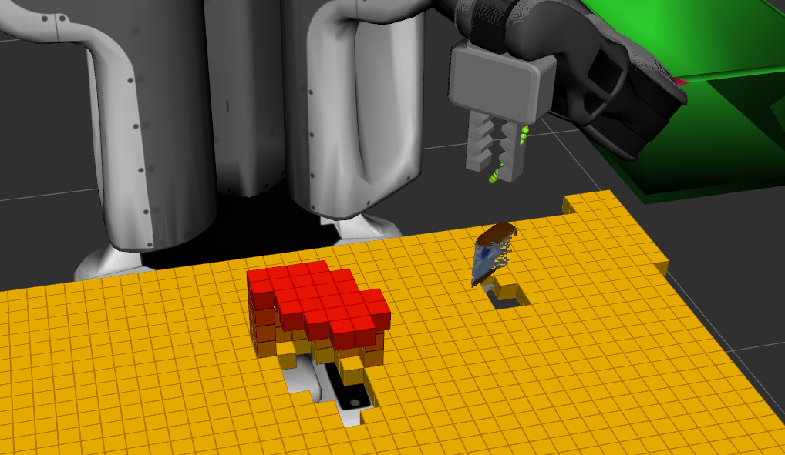

## Project: Perception Pick & Place
### Writeup Template: You can use this file as a template for your writeup if you want to submit it as a markdown file, but feel free to use some other method and submit a pdf if you prefer.

---


# Required Steps for a Passing Submission:
1. Extract features and train an SVM model on new objects (see `pick_list_*.yaml` in `/pr2_robot/config/` for the list of models you'll be trying to identify).
2. Write a ROS node and subscribe to `/pr2/world/points` topic. This topic contains noisy point cloud data that you must work with.
3. Use filtering and RANSAC plane fitting to isolate the objects of interest from the rest of the scene.
4. Apply Euclidean clustering to create separate clusters for individual items.
5. Perform object recognition on these objects and assign them labels (markers in RViz).
6. Calculate the centroid (average in x, y and z) of the set of points belonging to that each object.
7. Create ROS messages containing the details of each object (name, pick_pose, etc.) and write these messages out to `.yaml` files, one for each of the 3 scenarios (`test1-3.world` in `/pr2_robot/worlds/`).  [See the example `output.yaml` for details on what the output should look like.](https://github.com/udacity/RoboND-Perception-Project/blob/master/pr2_robot/config/output.yaml)
8. Submit a link to your GitHub repo for the project or the Python code for your perception pipeline and your output `.yaml` files (3 `.yaml` files, one for each test world).  You must have correctly identified 100% of objects from `pick_list_1.yaml` for `test1.world`, 80% of items from `pick_list_2.yaml` for `test2.world` and 75% of items from `pick_list_3.yaml` in `test3.world`.
9. Congratulations!  Your Done!

# Extra Challenges: Complete the Pick & Place
7. To create a collision map, publish a point cloud to the `/pr2/3d_map/points` topic and make sure you change the `point_cloud_topic` to `/pr2/3d_map/points` in `sensors.yaml` in the `/pr2_robot/config/` directory. This topic is read by Moveit!, which uses this point cloud input to generate a collision map, allowing the robot to plan its trajectory.  Keep in mind that later when you go to pick up an object, you must first remove it from this point cloud so it is removed from the collision map!
8. Rotate the robot to generate collision map of table sides. This can be accomplished by publishing joint angle value(in radians) to `/pr2/world_joint_controller/command`
9. Rotate the robot back to its original state.
10. Create a ROS Client for the “pick_place_routine” rosservice.  In the required steps above, you already created the messages you need to use this service. Checkout the [PickPlace.srv](https://github.com/udacity/RoboND-Perception-Project/tree/master/pr2_robot/srv) file to find out what arguments you must pass to this service.
11. If everything was done correctly, when you pass the appropriate messages to the `pick_place_routine` service, the selected arm will perform pick and place operation and display trajectory in the RViz window
12. Place all the objects from your pick list in their respective dropoff box and you have completed the challenge!
13. Looking for a bigger challenge?  Load up the `challenge.world` scenario and see if you can get your perception pipeline working there!

# [Rubric](https://review.udacity.com/#!/rubrics/1067/view) Points
### Here I will consider the rubric points individually and describe how I addressed each point in my implementation.

---
## 1. Writeup / README

### Provide a Writeup / README that includes all the rubric points and how you addressed each one.  You can submit your writeup as markdown or pdf.

You're reading it!

## 2. Exercise 1, 2 and 3 pipeline implemented
### 2.1. Complete Exercise 1 steps. Pipeline for filtering and RANSAC plane fitting implemented.

Exercise 1 implements the filtering step of the perception pipeline which is given a point cloud data for the scene, extract the table and the objects point cloud.

Load PCL cloud data from file.
```py
# Import PCL module
import pcl

# Load Point Cloud file
cloud = pcl.load_XYZRGB('tabletop.pcd')
```
Perform downsampling with VoxelGrid filter. After experimentation it was found that LEAF_SIZE of 0.01 meter is reasonable.


```py

# Voxel Grid filter Voxel Grid Downsampling
vox = cloud.make_voxel_grid_filter()
LEAF_SIZE = 0.01
vox.set_leaf_size(LEAF_SIZE, LEAF_SIZE, LEAF_SIZE)

cloud_filtered = vox.filter()
filename = 'voxel_downsampled.pcd'
pcl.save(cloud_filtered, filename)
```
Focus on a specific range in the Z axis by extracting point cloud in that range only using PassThrough filter. We choose to filter points in the range 0.6 to 1.1 meters along the Z axis.


```py
# PassThrough filter
passthrough = cloud_filtered.make_passthrough_filter()

filter_axis = 'z'
passthrough.set_filter_field_name(filter_axis)
axis_min = 0.6
axis_max = 1.1
passthrough.set_filter_limits(axis_min, axis_max)
cloud_filtered = passthrough.filter()
filename = 'pass_through_filtered.pcd'
pcl.save(cloud_filtered, filename)
```
Fit the point cloud in a Plane model using RANSAC, such that any point that fit the model is considered a table, otherwise it is an object. Using max_distance of 0.01 seems to work after experimentation.


```py
# RANSAC plane segmentation using RANSAC Plan Fitting
seg = cloud_filtered.make_segmenter()
seg.set_model_type(pcl.SACMODEL_PLANE)
seg.set_method_type(pcl.SAC_RANSAC)

max_distance = .01
seg.set_distance_threshold(max_distance)

inliers, coefficients = seg.segment()

# Extract inliers using ExtractIndices Filter
extracted_inliers = cloud_filtered.extract(inliers, negative=True)
filename = 'extracted_inliners.pcd'
pcl.save(extracted_inliers, filename)

# Extract outliers
extracted_inliers = cloud_filtered.extract(inliers, negative=False)
filename = 'extracted_outliers.pcd'
pcl.save(extracted_inliers, filename)
```

#### 2.2. Complete Exercise 2 steps: Pipeline including clustering for segmentation implemented.

`pcl_callback` is the handler for `/sensor_stick/point_cloud` messages we subscribed earlier in the `__main__`. First part of it just converts the ROS point cloud to PCL point cloud and perform filtering per Exercise-1.

```py
def pcl_callback(pcl_msg):

    # TODO: Convert ROS msg to PCL data
    cloud = ros_to_pcl(pcl_msg)

    # TODO: Voxel Grid Downsampling
    vox = cloud.make_voxel_grid_filter()
    vox.set_leaf_size(LEAF_SIZE, LEAF_SIZE, LEAF_SIZE)
    vox_cloud = vox.filter()

    # TODO: PassThrough Filter
    passthrough = vox_cloud.make_passthrough_filter()
    filter_axis = 'z'
    passthrough.set_filter_field_name(filter_axis)
    axis_min = 0.76
    axis_max = 1.1
    passthrough.set_filter_limits(axis_min, axis_max)
    passthrough_cloud = passthrough.filter()

    # TODO: RANSAC Plane Segmentation
    seg = passthrough_cloud.make_segmenter()
    seg.set_model_type(pcl.SACMODEL_PLANE)
    seg.set_model_type(pcl.SAC_RANSAC)
    max_distance = 0.01
    seg.set_distance_threshold(max_distance)
    inliers, coefficients = seg.segment()

    # TODO: Extract inliers and outliers
    cloud_objects = passthrough_cloud.extract(inliers, negative=True)
    cloud_table = passthrough_cloud.extract(inliers, negative=False)
```
We have changed the `passthrough` filter `axis_min` value from `0.6` that was used in Exercise-1 to `0.76` after trial and errors to solve the problem of RANSAC not fitting the table edge surface into the Plane model which make sense. Leading to considering that table edge surface as an object and being processed into the clustering step, which is undesirable.

Filtering result without and then with `axis_min` adjustment.


The other solution would be to use another `passthrough` filter along the Y axis to remove the table edge surface.

The second part of `pcl_callback` and hence the perception pipeline is to cluster the objects cloud using `DBSCAN` algorithm. The 3 parameters `ClusterTolerance`, `MinClusterSize` and `MaxClusterSize` were choosing after trial and errors to be `.05, 10, 2000` respectively. The result of that step is the indices of each cluster.

```py
    # TODO: Euclidean Clustering
    white_cloud = XYZRGB_to_XYZ(cloud_objects)
    tree = white_cloud.make_kdtree()
    ec = white_cloud.make_EuclideanClusterExtraction()
    ec.set_ClusterTolerance(0.05)
    ec.set_MinClusterSize(10)
    ec.set_MaxClusterSize(2000)
    ec.set_SearchMethod(tree)
    cluster_indices = ec.Extract()
```
The last part is mainly for visualization. We create a point cloud message with the cluster for each object colored differently and publish it over the `/pcl_cluster` topic.

```py
    # TODO: Create Cluster-Mask Point Cloud to visualize each cluster separately
    rospy.loginfo("cluster indices count %d", len(cluster_indices))
    cluster_color = get_color_list(len(cluster_indices))
    color_cluster_point_list = []

    for j, indices in enumerate(cluster_indices):
        for i, index in enumerate(indices):
            color_cluster_point_list.append(
                [white_cloud[index][0], white_cloud[index][1], white_cloud[index][2], rgb_to_float(cluster_color[j])])

    cloud_cluster = pcl.PointCloud_PointXYZRGB()
    cloud_cluster.from_list(color_cluster_point_list)

    # TODO: Convert PCL data to ROS messages
    ros_cloud_objects = pcl_to_ros(cloud_objects)
    ros_cloud_table = pcl_to_ros(cloud_table)
    ros_cloud_cluster = pcl_to_ros(cloud_cluster)

    # TODO: Publish ROS messages
    pcl_objects_pub.publish(ros_cloud_objects)
    pcl_table_pub.publish(ros_cloud_table)
    pcl_cluster_pub.publish(ros_cloud_cluster)
```

Clustering output without and then with `axis_min` adjustment. Notice the table edge in the first image.




#### 2.3. Complete Exercise 3 Steps. Features extracted and SVM trained.  Object recognition implemented.

**Feature Extraction**

The color and normals histograms computation was implemented in `features.py` in `compute_color_histograms` and `compute_normal_histograms`.

For both histograms, we settled on a reasonable 32 bins for each histogram, it was found that increasing the number of bins to 64 results in an increase in accuracy score but on the other hand result in overfitting and the model fail to detect one or more of the objects during ROS simulation. After inspecting the range of values for feature color and normals, the ranges were choses as `[0,256]` and `[-1,1]` for color (HSV and RGB) and normals respectively.

```py

COLOR_HIST_NBINS = 32
COLOR_HIST_BINS_RANGE = (0., 256.)
NORM_HIST_NBINS = 32
NORM_HIST_BINS_RANGE = (-1., 1.)

def compute_color_histograms(cloud, using_hsv=False):

    # Compute histograms for the clusters
    point_colors_list = []

    # Step through each point in the point cloud
    for point in pc2.read_points(cloud, skip_nans=True):
        rgb_list = float_to_rgb(point[3])
        if using_hsv:
            point_colors_list.append(rgb_to_hsv(rgb_list) * 255)
        else:
            point_colors_list.append(rgb_list)

    # Populate lists with color values
    channel_1_vals = []
    channel_2_vals = []
    channel_3_vals = []

    for color in point_colors_list:
        channel_1_vals.append(color[0])
        channel_2_vals.append(color[1])
        channel_3_vals.append(color[2])

    # TODO: Compute histograms
    channel_1_hist = np.histogram(
        channel_1_vals, bins=COLOR_HIST_NBINS, range=COLOR_HIST_BINS_RANGE)
    channel_2_hist = np.histogram(
        channel_2_vals, bins=COLOR_HIST_NBINS, range=COLOR_HIST_BINS_RANGE)
    channel_3_hist = np.histogram(
        channel_3_vals, bins=COLOR_HIST_NBINS, range=COLOR_HIST_BINS_RANGE)

    # TODO: Concatenate and normalize the histograms
    hist_features = np.concatenate(
        (channel_1_hist[0], channel_2_hist[0], channel_3_hist[0])).astype(np.float64)
    if np.sum(hist_features) != 0:
        normed_features = hist_features / np.sum(hist_features)
    else:
        normed_features = hist_features
    return normed_features


def compute_normal_histograms(normal_cloud):
    norm_x_vals = []
    norm_y_vals = []
    norm_z_vals = []

    for norm_component in pc2.read_points(normal_cloud,
                                          field_names=(
                                              'normal_x', 'normal_y', 'normal_z'),
                                          skip_nans=True):
        norm_x_vals.append(norm_component[0])
        norm_y_vals.append(norm_component[1])
        norm_z_vals.append(norm_component[2])

    # TODO: Compute histograms of normal values (just like with color)
    norm_x_hist = np.histogram(
        norm_x_vals, bins=NORM_HIST_NBINS, range=NORM_HIST_BINS_RANGE)
    norm_y_hist = np.histogram(
        norm_y_vals, bins=NORM_HIST_NBINS, range=NORM_HIST_BINS_RANGE)
    norm_z_hist = np.histogram(
        norm_z_vals, bins=NORM_HIST_NBINS, range=NORM_HIST_BINS_RANGE)

    # TODO: Concatenate and normalize the histograms
    hist_features = np.concatenate(
        (norm_x_hist[0], norm_y_hist[0], norm_z_hist[0])).astype(np.float64)
    if np.sum(hist_features) != 0:
        normed_features = hist_features / np.sum(hist_features)
    else:
        normed_features = hist_features
    return normed_features
```
We modified `capture_features.py` to increase the number of iterations to 50 iteration and `compute_color_histograms` to use HSV instead of RGB by passing `using_hsv=True`.

Running `capture_features.py` results in training dataset getting written to `training_set.sav`.

**SVM Training**

Running `train_svm.py` results in the model getting trained with 5-fold cross-validaiton and written to `model.sav`. The SVM confusion matrix getting plotted as follows:


Training output:
```
Features in Training Set: 350
Invalid Features in Training set: 0
Scores: [0.9        0.91428571 0.95714286 0.87142857 0.91428571]
Accuracy: 0.91 (+/- 0.06)
accuracy score: 0.9114285714285715
```
 **Training Observations**
- Using HSV color histogram yields better classification accuracy than RGB color histogram.
- Increasing the number of iterations to 100 and 500 result in better accuracy score, but also in model overfitting and it fail to properly detect one or more of the objects in ROS simulation.
- The highest accuracy score achieved was 97% using 64 bin histogram bins and 500 iteration, but that model resulted from a sever overfitting by classifying all objects in ROS simulation as `create` object.

**Tuning the SVM hyper-parameters**

With some online research, we found a programmatic way to tune the model hyper-parameters using `sklearn.model_selection.GridSearchCV` to perform an exhaustive K-fold cross-validation with all combinations of the a provided hyper-parameters table.

```py
    # Set the parameters by cross-validation
    parameters = [{'kernel': ['rbf'],
                   'gamma': [1e-4, 1e-3, 0.01, 0.1, 0.2, 0.5],
                    'C': [1, 10, 100, 1000]},
                  {'kernel': ['linear'], 'C': [1, 10, 100, 1000]}]

    print('# Start Tuning hyper-parameters')
    clf = GridSearchCV(svm.SVC(decision_function_shape='ovr'), parameters, cv=5)
    clf.fit(X_train, y_train)
    print("Best parameters set found on development set:")
    print(clf.best_params_)
    print("Grid scores on training set:")
    means = clf.cv_results_['mean_test_score']
    stds = clf.cv_results_['std_test_score']
    for mean, std, params in zip(means, stds, clf.cv_results_['params']):
        print("%0.3f (+/-%0.03f) for %r"
            % (mean, std * 2, params))
    print('# End Tuning hyper-parameters')
```
Following is the result of the Grid Search Cross Validation for our SVM classifier, and we can see that the `rbf` kernel can yield a slightly better accuracy (~2%) score over the `linear` kernel.

```
# Start Tuning hyper-parameters
Best parameters set found on development set:
{'kernel': 'rbf', 'C': 1000, 'gamma': 0.001}
Grid scores on training set:
0.500 (+/-0.031) for {'kernel': 'rbf', 'C': 1, 'gamma': 0.0001}
0.680 (+/-0.111) for {'kernel': 'rbf', 'C': 1, 'gamma': 0.001}
0.846 (+/-0.100) for {'kernel': 'rbf', 'C': 1, 'gamma': 0.01}
0.703 (+/-0.098) for {'kernel': 'rbf', 'C': 1, 'gamma': 0.1}
0.597 (+/-0.098) for {'kernel': 'rbf', 'C': 1, 'gamma': 0.2}
0.503 (+/-0.113) for {'kernel': 'rbf', 'C': 1, 'gamma': 0.5}
0.657 (+/-0.120) for {'kernel': 'rbf', 'C': 10, 'gamma': 0.0001}
0.843 (+/-0.104) for {'kernel': 'rbf', 'C': 10, 'gamma': 0.001}
0.903 (+/-0.064) for {'kernel': 'rbf', 'C': 10, 'gamma': 0.01}
0.737 (+/-0.082) for {'kernel': 'rbf', 'C': 10, 'gamma': 0.1}
0.634 (+/-0.093) for {'kernel': 'rbf', 'C': 10, 'gamma': 0.2}
0.540 (+/-0.109) for {'kernel': 'rbf', 'C': 10, 'gamma': 0.5}
0.843 (+/-0.116) for {'kernel': 'rbf', 'C': 100, 'gamma': 0.0001}
0.917 (+/-0.091) for {'kernel': 'rbf', 'C': 100, 'gamma': 0.001}
0.903 (+/-0.082) for {'kernel': 'rbf', 'C': 100, 'gamma': 0.01}
0.746 (+/-0.078) for {'kernel': 'rbf', 'C': 100, 'gamma': 0.1}
0.640 (+/-0.080) for {'kernel': 'rbf', 'C': 100, 'gamma': 0.2}
0.543 (+/-0.102) for {'kernel': 'rbf', 'C': 100, 'gamma': 0.5}
0.909 (+/-0.084) for {'kernel': 'rbf', 'C': 1000, 'gamma': 0.0001}
0.923 (+/-0.090) for {'kernel': 'rbf', 'C': 1000, 'gamma': 0.001}
0.914 (+/-0.081) for {'kernel': 'rbf', 'C': 1000, 'gamma': 0.01}
0.746 (+/-0.078) for {'kernel': 'rbf', 'C': 1000, 'gamma': 0.1}
0.640 (+/-0.080) for {'kernel': 'rbf', 'C': 1000, 'gamma': 0.2}
0.543 (+/-0.102) for {'kernel': 'rbf', 'C': 1000, 'gamma': 0.5}
0.897 (+/-0.091) for {'kernel': 'linear', 'C': 1}
0.909 (+/-0.053) for {'kernel': 'linear', 'C': 10}
0.909 (+/-0.050) for {'kernel': 'linear', 'C': 100}
0.903 (+/-0.058) for {'kernel': 'linear', 'C': 1000}
# End Tuning hyper-parameters
```

**Object Recognition**

Returning to perception pipeline implementation in `object_recognition.py`. We first we need to load the trained SVM model `model.sav` from disk.

```py
    # TODO: Load Model From disk
    model = pickle.load(open('model.sav', 'rb'))
    clf = model['classifier']
    encoder = LabelEncoder()
    encoder.classes_ = model['classes']
    print('classes: {}'.format(encoder.classes_))
    scaler = model['scaler']
```

Building on the filtering and clustering code form Exercise-2 in `pcl_callback` we perform the last step of the perception pipeline which is object detection. We iterate over the clusters point cloud and for each we build the feature vector using `compute_color_histograms` and `compute_normal_histograms` and pass that to the SVM to perform prediction. We publish a marker for that object to RViz and append a `DetectedObject` to a list to publish later to `/detected_objects` topic.

```py
    detected_objects_labels = []
    detected_objects = []

    # Classify the clusters! (loop through each detected cluster one at a time)
    for index, pts_list in enumerate(cluster_indices):
        # Grab the points for the cluster
        pcl_cluster = cloud_objects.extract(pts_list)
        ros_cluster = pcl_to_ros(pcl_cluster)

        # Compute the associated feature vector
        chists = compute_color_histograms(ros_cluster, using_hsv=True)
        normals = get_normals(ros_cluster)
        nhists = compute_normal_histograms(normals)
        feature = np.concatenate((chists, nhists))

        # Make the prediction, retrieve the label for the result
        # and add it to detected_objects_labels list
        prediction = clf.predict(scaler.transform(feature.reshape(1, -1)))
        label = encoder.inverse_transform(prediction)[0]
        detected_objects_labels.append(label)

        # Publish a label into RViz
        label_pos = list(white_cloud[pts_list[0]])
        label_pos[2] += .4
        object_markers_pub.publish(make_label(label, label_pos, index))

        # Add the detected object to the list of detected objects.
        do = DetectedObject()
        do.label = label
        do.cloud = ros_cluster
        detected_objects.append(do)

    # Publish the list of detected objects
    rospy.loginfo('Detected {} objects: {}'.format(
        len(detected_objects_labels), detected_objects_labels))
    detected_objects_pub.publish(detected_objects)
```

Here is the classification of each cluster with the object label marked above the cluster directly:


**Source Code**

The implementation of the 3 exercises can be found in the project subdir `exercies` which have the following:
- `RANSAC.py`: exercise 1 solution.
- `segmentation.py`: exercise 2 solution.
- `object_recognition.py`: exercise 3 solution.
- `features.py`: implements histogram functions.
- `model.sav` SVM model trained using the dataset `training_set.sav`.

## 3. Pick and Place Setup

### 3.1. For all three tabletop setups (`test*.world`), perform object recognition, then read in respective pick list (`pick_list_*.yaml`). Next construct the messages that would comprise a valid `PickPlace` request output them to `.yaml` format.

### 3.1.2. Feature Extraction and SVM Training

The `capture_features.py` module was extended to capturing features for both models used in the exercise and those in the pick place project with 50 iterations for each object model.

```py
model_sample_count = 50

if __name__ == '__main__':
    rospy.init_node('capture_node')

    exercise_models = [\
       'beer',
       'bowl',
       'create',
       'disk_part',
       'hammer',
       'plastic_cup',
       'soda_can']

    project_models = [\
        'sticky_notes',
        'book',
        'snacks',
        'biscuits',
        'eraser',
        'soap2',
        'soap',
        'glue']

    models = exercise_models

    rospy.loginfo('model_sample_count={}'.format(model_sample_count))
    rospy.loginfo('models={}'.format(models))
```

### 3.1.1. Perception Pipeline

Building on the perception pipeline implemented in Exercise-3, we upgraded the pipeline a little bit to work properly in the Pick Place environment as detailed next. The following sequence illustrates the perception pipeline in an ordered manner, starts with the the input which is a noisy RGBD point cloud `PointCloud_XYZRGB` and ends with that output which is the detected objects as a list of `DetectedObject`. The scene used in the illustration is `test2.world`.

**(1) INPUT: Point Cloud**

The RBGD camera used in the simulation has alot of noise as captured from `/camera/depth_registered/points` topic.


**(2) Filtering: Passthrough Filter**

In addition to the `passtrhough` filter along the Z-axis (`0.6 to 1.1`), we use an extra `passthrough` filter along the Y-axis (`-0.5 to 0.5`) to remove the edges of the left and right dropboxes.


**(3) Filtering: Statistical Outlier Removal Filter**


After experimenting with different values of mean and stdv multiplier it was observed that mean of 5 and stdv multiplier of 1 yields the best and most efficient performance.

```py
# Statistical Outlier Filtering
outlier_fltr = self.pcl_cloud.make_statistical_outlier_filter()
# Set the number of neighboring points to analyze for any given point
outlier_fltr.set_mean_k(5)
# Set threshold scale factor
std_mul = 1
# Any point with a mean distance larger than global (mean distance+x*std_dev) will be considered outlier
outlier_fltr.set_std_dev_mul_thresh(std_mul)
self.pcl_cloud = outlier_fltr.filter()
```

**It was observed that**
- Increasing the mean value results in the filter taking longer time to complete processing, and it adds up to 2 seconds to the perception pipeline processing time when the mean is 50 which is unacceptable.
- Increasing the mean value and reducing the stdv multiplier results in a better noise filtering, but can remove some small parts from the objects point cloud, resulting in a reduced object detection accuracy.

**(4) Filtering: VoxelGrid Filter**

It was found that VoxelGird leaf size of 0.01 produces non-optimal object detection results in `test2.world` where it detected the non-covered glue object as biscuits i.e. 80% (4/5), while in `test3.world` it was able to detect all the objects i.e. 100% (8/8). By decreasing the leaf size to 0.005, we were able to detect all objects 100% (5/5) in `test2.world` but missed on the partially covered glue (covered by the book) in `test3.world` 87.5% (7/8) . As a result we choose to work with 0.005 leaf size since incorrectly detecting a partially covered glue is more acceptable result than incorrectly detecting a non-covered glue and also since no significant drop in performance was observed.


**(5) Segmentation: RANSAC**

Using the same parameters for the RANSAC segmenter as in the exercises to extract both the table and the objects point cloud.

Table point cloud (Inliers)


Objects point cloud (Outliers)


**(6) Segmentation: DBSCAN (Euclidean Clustering)**

Using the same parameters for the Euclidean Clustering segmenter as in the exercises but increasing the `MaxClusterSize` from 2000 to 3000 to be able to detected large objects like the red snack box.


**(7) OUTPUT: Object Recognition**


One small enhancement to the object detection step, is that we publish markers over the centroids of the detected objects instead of the first point cloud of an object, and that is using the `get_pcl_centroid` helper.

```py
def get_pcl_centroid(pcl_cloud):
    """Return the centroid of a PCL cloud."""
    # Get the PointCloud for a given object and obtain it's centroid
    # Convert ROS point cloud to a 2D numpy float32 array where each row is [x,y,z,rgb]
    points_arr = pcl_cloud.to_array()
    # Compute the mean along the 1st dimension and extract the first 3 elements which
    # correspond to [x,y,z]
    centroid = np.mean(points_arr, axis=0)[0:3]
    return [np.asscalar(centroid[0]),
            np.asscalar(centroid[1]),
            np.asscalar(centroid[2])]
```

Following is the object detection result for the 3 test worlds, `test1.world`, `test2.world` and `test3.world` in order.


**Implementation**

The perception pipeline is encapsulated and implemented as a reusable `Pr2Perception` class with only 2 public methods:
- `update(self, pcl_cloud)`: gets called from the `pcl_callback` each time a new PCL message arrives. It carries the filtering, segmentation and object detection stages and updates a list of detected objects.
- `get_detected_object_by_label(self, label)`: returns a `DetectedObject` instance from the detected objects list that has a specific label.

`Pr2Perception` is responsible also for:
- Loading of the SVM model from disk.
- Publish the PCL cloud output of each filter in the filtering stage.
- Measure timing of the perception pipeline phases and output that to console.

### 3.1.3 Pick Place Challenge

The PR2 pick place motion is encapsulated and implemented as a reusable `Pr2StateMachine` class. It implements the PR2 pick place challenge logic as a simple finite state-machine.

| State | Role
--- | ---
`init` | Makes sure the PR2 starts from a neutral known orientation.
`explore-right` | Rotates left to collect the left-side table point cloud.
`explore-left` | Rotates right to collect the right-side table point cloud.
`plan` | Creates a sequential pick place plan represented as an ordered list of pick place tasks each of type `PickPlaceSrvParam` and writes the `output_*.yaml` file.
`execute` | Carries out the pick place plan and for each task, publishes the necessary point cloud collision data.
`done` | Idle state reached when the PR2 completes executing the pick place plan.

**Implementation**

Both `Pr2Perception` and `Pr2StateMachine` are implemented in the same module `pr2_pick_place.py` which implements the `pr2_pick_place` node.

`Pr2StateMachine` depends on `Pr2Perception` to do its and they get instantiated on node initialization as follows:

```py
pr2_perception = Pr2Perception()
pr2_state_machine = Pr2StateMachine(pr2_perception)
```

The node registers for PointCloud2 msg `/pr2/world/points` and get handled in `pcl_callback` which is responsible for updating both the `Pr2Perception` and `Pr2StateMachine` instances as follows:

```py
def pcl_callback(pcl_msg):
    """A callback for every received PointCloud2 msg"""
    global frame_num

    frame_num += 1
    rospy.loginfo('### PCL BEGIN Frame{} ###'.format(frame_num))

    pcl_cloud = ros_to_pcl(pcl_msg)
    pr2_perception.update(pcl_cloud)

    # Update the perception pipeline twice faster than the state-machine
    # It was found that updating both at the same rate result in the
    # state-machine operating sometimes on a stale PointCloud msgs
    if frame_num % 2:
        pr2_state_machine.update()

    rospy.loginfo('### PCL END ##')
```

The `Pr2StateMachine` defines the PR2 states as follows:

```py
# PR2 finite state machine states which follows the following state
# transitions:
# init -> explore-left: on initialization done
# explore-left -> explore-right: on left table collision data collected
# explore-right -> plan: on right table collision data collected
# plan -> execute: on pick_place plan built based on detected objects
# execute -> done: on pick_place plan has completed execution
PR2_STATE_INIT = 'init'
PR2_STATE_EXPLORE_RIGHT = 'explore-right'
PR2_STATE_EXPLORE_LEFT = 'explore-left'
PR2_STATE_PLAN = 'plan'
PR2_STATE_EXECUTE = 'execute'
PR2_STATE_DONE = 'done'
```

Each state logic is implemented as a private method where each state is responsible for performing the next state transition. The state machine gets updated in the `update` method as follows:

```py
def update(self):
    rospy.loginfo('PR2 current state is {}'.format(self.state))
    previous_state = self.state
    if self.state == self.PR2_STATE_INIT:
        self.__update_init()
    elif self.state == self.PR2_STATE_EXPLORE_LEFT:
        self.__update_explore_left()
    elif self.state == self.PR2_STATE_EXPLORE_RIGHT:
        self.__update_explore_right()
    elif self.state == self.PR2_STATE_PLAN:
        self.__update_plan()
    elif self.state == self.PR2_STATE_EXECUTE:
        self.__update_execute()
    elif self.state != self.PR2_STATE_DONE:
        raise ValueError('undefined PR2 state')

    if previous_state != self.state:
        rospy.logwarn(
            'PR2 state updated {} -> {}'.format(previous_state, self.state))
```

Both the the pick object list and the dropbox info get read from the param server as follows:

```py
# Read in the ordered pick_place list
self.pick_object_list_param = rospy.get_param('/object_list')

# Read in the dropbox data and reorganize it in a dictionary for easy
# and efficient data access
dropbox_param = rospy.get_param('/dropbox')
self.dropbox_dict = {}
for i in range(len(dropbox_param)):
    name = dropbox_param[i]['name']
    group = dropbox_param[i]['group']
    pos = dropbox_param[i]['position']
    self.dropbox_dict[group] = {'name': name, 'position': pos}
rospy.loginfo('dropbox_dict: {}'.format(self.dropbox_dict))
```

**PR2 Rotation (explore-left and explore-right)**

The purpose of the PR2 left and right in-place rotation is to collect left and right side tables point cloud to publish later to MoveIt! planner over `/pr2/3d_map/points` for the sake of collision avoidance. The helper blocking method `__rotate_in_place` implements an in-place rotation in a polling fashion as follows:

```py
def __rotate_in_place(self, pos_j1):
    """Rotate the PR2 in-place.

    The method is a blocking call and won't return unless the rotation
    is completed successfully or an error occurred.

    Args:
        pos_j1: target rotation angle in rad.
    """
    time_elapsed = rospy.Time.now()
    self.joint_controller_pub.publish(pos_j1)
    while True:
        joint_state = rospy.wait_for_message(
            '/pr2/joint_states', JointState)

        curr_j1 = joint_state.position[PR2_WORLD_JOINT_IDX]
        if Pr2StateMachine.__rotate_at_goal_helper(curr_j1, pos_j1):
            time_elapsed = joint_state.header.stamp - time_elapsed
            break

    rospy.loginfo('PR2 world_joint rotated to {} in {}s'.format(
        pos_j1, time_elapsed.to_sec()))
```

The 3 PR2 rotation angles were defined as follows:

```py
# The angle in rad for the PR2 left rotation.
PR2_ROTATE_LEFT_ANGLE = 1.20

# The angle in rad for the PR2 right rotation.
PR2_ROTATE_RIGHT_ANGLE = -1.20

# The angle in rad for the PR2 neutral pose.
PR2_ROTATE_CENTER_ANGLE = 0.
```


**Output yaml files (plan)**

The `plan` state clears the current task list (plan) and iterates over the pick list and for each item it construct a `PickPlaceSrvParam` which is defined as follows:

```py
class PickPlaceSrvParam:
    """Encapsulate the pick_place_routine parameters and a task as well."""

    def __init__(self):
        self.test_scene_num = Int32()
        self.object_name = String()
        self.arm_name = String()
        self.pick_pose = Pose()
        self.place_pose = Pose()
```

The pick_pose is the centroid of the object point cloud which is computed using the helper `get_pcl_centroid`.

The place_pose is a random location inside the dropbox along its depth, and this to avoid object stacking. A more accurate way is to compute the object dimensions and the dropbox inside volume and partition it, but that is expected to be an expensive operation. We decided to use random placement for now.

```py
# Choose a random place in the dropbox along its depth
place_x = random.uniform(
    dropbox_pos[0] - DROPBOX_DEPTH / 2, dropbox_pos[0] + DROPBOX_DEPTH / 2)
pick_place_param.place_pose.position.x = place_x
pick_place_param.place_pose.position.y = dropbox_pos[1]
pick_place_param.place_pose.position.z = dropbox_pos[2]
```

For each target item we convert its `PickPlaceSrvParam` into a yaml dict and append it to a `yaml_dict_list` to write later to disk using the helper `send_to_yaml`.

```py
# Create a list of dictionaries (made with make_yaml_dict()) for later
# output to yaml format
yaml_dict = make_yaml_dict(
    pick_place_param.test_scene_num,
    pick_place_param.arm_name,
    pick_place_param.object_name,
    pick_place_param.pick_pose,
    pick_place_param.place_pose)
self.yaml_dict_list.append(yaml_dict)
```
A non-empty task list will result in a transition to the `execute` state, other wise the PR2 will stay in the `plan` state and try replanning.

**Collision Map (execute)**

Before the `execute` state start executing the next task in the pick place plan, it needs to clear the MoveIt! collision map and re-publish the point cloud of the objects to avoid again.

To clear the collision map we use the clear_octomap service:

```py
# Createy proxy for the octmap clear service to be able to clear the
# MoveIt! collision map before each pick_place iteration
rospy.wait_for_service('clear_octomap')
self.clear_octmap_srv = rospy.ServiceProxy('clear_octomap', Empty)

def __clear_collision_map(self):
    """Clears MoveIt! collision map and start from scratch"""
    try:
        self.clear_octmap_srv()
    except rospy.ServiceException, e:
        rospy.logerr('Service call failed: {}'.format(e))
```

The helper `__publish_collision_cloud` is responsible for:
- Clearing the collision map.
- Publishing the left, center, and right side tables point cloud.
- Publishing the point cloud of all currently detected objects except the object we are about to pick place.

Here is a screenshot showing PR2 collision map from `test2.world`:


**PR2 Arm Motion (execute)**

The helper method `__update_execute` implements the execute logic. It uses a running index `self.current_task_idx` to keep track of which task to execute next. It passes the task parameters to the `pick_place_routine` service call and advances that index on service call success.


However, the issue that prevented from performing pick place for all objects in the scene successfully is MoveIt! failure to grasp objects, most of the time the object slip. I tried to increase the gripper effort in the .xacro file, it helped a little bit with the biscuits box but didn't help much with the other small objects. See example:



**Pick Place result for the 3 worlds**

TODO: add screenshots once the PR2 gripper issue is fixed.

**Performance**

Our perception pipeline finishes 1 cycle in around 0.733 second:

```
[INFO] [1520937891.004118, 993.247000]: perception fltr: 0.54, segm: 0.037, objd: 0.156, total 0.733
```

Commenting out all debug point cloud messages that gets published during filtering reduces the cycle time down to around .583 second.

[INFO] [1520939782.932496, 988.725000]: perception fltr: 0.000999999999976, segm: 0.377, objd: 0.205, total 0.583

**Areas of Improvement**

If we want to take this project further, there are a couple of open issues that need attention:
- **Model overfitting detection**
  - When we tried 500 iteration/object or increasing the histogram bins to 64 we fell into the overfitting pit. The k-fold cross-validation was showing very promising +90% accuracy but the model fails to detect most of not all of the objects when used in the pick place environment.
  - The major difference between the learning environment and the pick place environment is the noise as well as the downsampling of point cloud.
  - The k-fold cross-validation wasn't helpful enough in our case to detect overfitting, we still need a more realistic and effective cross-validation method to detect over-fitting.
- **Object detection accuracy**
  - The perception pipeline fail to recognize some objects in the scene like the partially covered glue in `test3.world`.
  - On way to improve that is to work on the features. HSV and normal histograms may not be enough. Some discussions on slack were suggesting that using `YCbCr` color space beside `HSV` can improve accuracy.
  - We may want to investigate and experiment with other features.
- **Detect pick place operation failure**
  - From time to time MoveIt! doesn't grip the object correctly or the object fall in the way to the dropbox, sometimes the object doesn't get dropped correctly in the dropbox.
  - The PR2 needs a way to detect whether the pick place operation was done correctly since because the `pick_place_routine` service response is not enough.
- **Re-planning and mitigation on failure**
  - In case of pick place failure the PR2 should re-plan and think of ways to mitigate the failure. e.g. increase the gripping effort gradually untill the pick place succeed.
- **Improve PR2 gripping**
  - For unknown reasons, MoveIt! sometimes doesn't correctly grip the object. It performs the grip step but the object slips. This needs investigation and fixing.

### 3.1.4. How To Run

The pr2_pick_place node should be launched using the launch file, and here is how to run the pick place project:

```
roslaunch pr2_robot pick_place_project.launch
roslaunch pr2_robot pr2_pick_place.launch
```

**Notes:**
- The `output` subdir contains the output yaml files for the 3 worlds from my run. However, when running the project on your PC, the output yaml files get written to `pr2_robot/scripts` subdir.
- Remember to change `TEST_SCENE_NUM` in `pr2_pick_place.py` to match the scene number used in the `pick_place_project.launch`